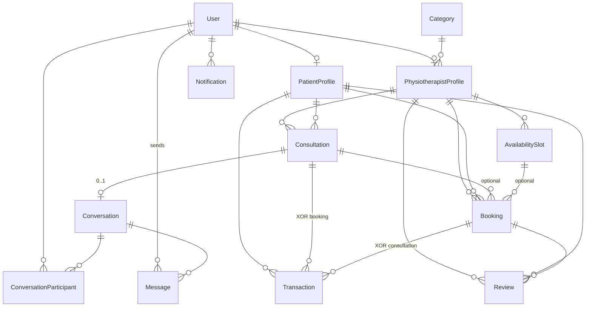

# Booking Management System - Database Schema (MVP)

This document explains the Prisma data model for your physiotherapy booking platform.

## Why this schema matters

- It separates **authentication/identity** (`User`) from domain data (bookings, consultations, transactions).
- It supports your 3 roles with **role-based authorization**.
- It keeps room for growth (analytics, moderation, and audit-friendly status fields).

## Core entities and relationships

### 1) User
- Represents any account in the system: `ADMIN`, `PATIENT`, or `PHYSIOTHERAPIST`.
- One `User` can have:
  - one optional `PatientProfile`
  - one optional `PhysiotherapistProfile`
  - many notifications
  - many chat participations (through `ConversationParticipant`)

### 2) PatientProfile
- Stores patient-specific data separated from base auth fields.
- Belongs to exactly one `User`.
- Can create many consultations, bookings, transactions, and reviews.

### 3) PhysiotherapistProfile
- Stores therapist-specific data (license, experience, verification status, etc.).
- Belongs to exactly one `User`.
- Connected to one `Category` (specialization).
- Has many schedules, consultations, bookings, and reviews.
- `onlineUntil` (nullable): bumped by dashboard heartbeat; when in the future,
  the therapist counts as "online now" for browse filters.

### 4) Category
- Master data for therapist specialization (for example: sports injury, post-surgery).
- Managed by admin.
- One category can be assigned to many physiotherapists.

### 5) AvailabilitySlot
- Therapist schedule blocks (date, start time, end time).
- Used to control booking availability.

### 6) Consultation
- Paid online chat session between patient and therapist.
- Status lifecycle: `REQUESTED -> ACCEPTED -> IN_PROGRESS -> COMPLETED`,
  with `CANCELLED` reachable from any non-terminal state.
- `feeSnapshot` locks the therapist's `consultationFee` at creation time.
- `slaTier` (`STANDARD` | `FAST_ONLINE`): patient-selected SLA for the first
  therapist chat message after payment; missed SLA triggers automatic admin
  refund via cron (see Phase 3 in [`15-booking-transaction-feature.md`](./15-booking-transaction-feature.md)).
- `acceptedAt` / `startedAt` / `completedAt` audit the lifecycle.
- `IN_PROGRESS` is only entered after the linked transaction is marked PAID
  by admin — this is the "pay-first chat unlock" gate.

### 7) Conversation, ConversationParticipant, Message
- Simple API-based chat (non-realtime).
- A conversation has multiple participants and messages.
- Messages store sender and content.
- Reads work regardless of consultation status (audit trail). New
  conversations and new messages require the linked consultation to be
  `IN_PROGRESS` (admin moderation bypasses this).

### 8) Booking
- Appointment record for an in-person visit (home or clinic).
- Links patient + therapist (+ optional consultation, optional slot).
- Status lifecycle supports operational flow and cancellation.

### 9) Transaction
- Dummy payment model. Linked to **either** a `Booking` OR a `Consultation`
  via the nullable `bookingId` / `consultationId` foreign keys (XOR rule
  enforced at the service layer).
- Status lifecycle: `PENDING`, `PAID`, `REFUNDED`, `FAILED`.
- When a consultation transaction is marked `PAID`, the consultation is
  auto-promoted from `ACCEPTED` to `IN_PROGRESS`.
- When a consultation transaction is refunded, the consultation is
  auto-`CANCELLED`.
- Supports admin refund simulation.

### 10) Review
- Patient feedback for completed sessions.
- Can be moderated by admin (`isHidden`, `moderationNote`).

### 11) Notification
- Simple in-app notifications.
- Linked to user and marks read/unread state.

## Entity relationship diagram (ERD)

### Published diagram (dbdiagram.io)

**Live ERD (visual, zoomable, export PNG/PDF):**  
[https://dbdiagram.io/d/Crack-Physio-6a05b6997a923b9472b2f884](https://dbdiagram.io/d/Crack-Physio-6a05b6997a923b9472b2f884)

Use this link for rubric / mentor review. Keep the diagram in sync when you
change [`../prisma/schema.prisma`](../prisma/schema.prisma) (e.g. new enums,
`Consultation.slaTier`, indexes).

### Machine-readable diagram (DBML in repo)

The file [`database-erd.dbml`](./database-erd.dbml) is **DBML** for the same
model. You can **Import** it into [dbdiagram.io](https://dbdiagram.io) to fork
or refresh the published project, or export diagrams offline.

The DBML mirrors `prisma/schema.prisma` (enums, tables, FKs, `onDelete`, and
notes for XOR / SLA). Update the DBML when the Prisma schema changes, then
re-paste into dbdiagram if you maintain the canvas there.

### Overview (Mermaid)

Rendered on GitHub when you view this file. Cardinality: `||--o|` = one to
zero-or-one; `||--o{` = one to zero-or-many.

**Transaction XOR:** each row has **either** `bookingId` **or**
`consultationId` set (never both, never neither) — enforced in application
code, not as a single DB CHECK constraint.

## Design decisions (mentor notes)

- **UUID primary keys**: safer for distributed systems and harder to guess than incremental IDs.
- **Enums for statuses**: prevents invalid state values and keeps business rules explicit.
- **Created/updated timestamps** everywhere: useful for audit and analytics.
- **Unique constraints**:
  - `User.email` must be unique.
  - one profile per user (`PatientProfile.userId`, `PhysiotherapistProfile.userId`).
  - one review per patient-booking pair.

_Source of truth for columns and indexes: `prisma/schema.prisma`._
