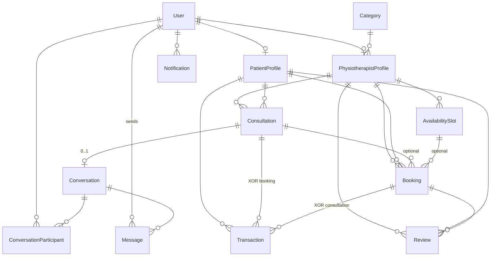

# Booking Management System - Database Schema (MVP)

This document explains the Prisma data model for your physiotherapy booking platform.

**Source of truth:** [`../prisma/schema.prisma`](../prisma/schema.prisma)  
**Machine-readable ERD:** [`database-erd.dbml`](./database-erd.dbml)  
**Last aligned with Prisma:** 2026-05-15 (audit only — no schema migration in this step)

## Why this schema matters

- It separates **authentication/identity** (`User`) from domain data (bookings, consultations, transactions).
- It supports your 3 roles with **role-based authorization**.
- It keeps room for growth (analytics, moderation, and audit-friendly status fields).

## Core entities and relationships

### 1) User
- Represents any account in the system: `ADMIN`, `PATIENT`, or `PHYSIOTHERAPIST`.
- One `User` can have:
  - one optional `PatientProfile`
  - one optional `PhysiotherapistProfile`
  - many notifications
  - many chat participations (through `ConversationParticipant`)

### 2) PatientProfile
- Stores patient-specific data separated from base auth fields.
- Belongs to exactly one `User`.
- Can create many consultations, bookings, transactions, and reviews.

### 3) PhysiotherapistProfile
- Stores therapist-specific data (license, experience, verification status, etc.).
- Belongs to exactly one `User`.
- Connected to one optional `Category` (specialization).
- Has many availability slots, consultations, bookings, and reviews.
- `verificationStatus`: `PENDING` → admin `APPROVED` or `REJECTED` (with `rejectionReason`, `verifiedAt`).
- `consultationFee` / `visitFee`: current list prices; copied to snapshots on consultation/booking create.
- `onlineUntil` (nullable): bumped by dashboard heartbeat; when in the future,
  the therapist counts as "online now" for browse filters and `FAST_ONLINE` SLA gate.

### 4) Category
- Master data for therapist specialization (for example: sports injury, post-surgery).
- Managed by admin.
- One category can be assigned to many physiotherapists.

### 5) AvailabilitySlot
- Therapist schedule blocks (date, start time, end time).
- Used to control booking availability.

### 6) Consultation
- Paid online chat session between patient and therapist.
- Status lifecycle: `REQUESTED -> ACCEPTED -> IN_PROGRESS -> COMPLETED`,
  with `CANCELLED` reachable from any non-terminal state.
- `feeSnapshot` locks the therapist's `consultationFee` at creation time.
- `slaTier` (`STANDARD` | `FAST_ONLINE`): patient-selected SLA for the first
  therapist chat message after payment; missed SLA triggers automatic admin
  refund via cron (see Phase 3 in [`15-booking-transaction-feature.md`](./15-booking-transaction-feature.md)).
- `acceptedAt` / `startedAt` / `completedAt` audit the lifecycle.
- `IN_PROGRESS` is only entered after the linked transaction is marked PAID
  by admin — this is the "pay-first chat unlock" gate.

### 7) Conversation, ConversationParticipant, Message
- Simple API-based chat (non-realtime).
- A conversation has multiple participants and messages.
- Messages store sender and content.
- Reads work regardless of consultation status (audit trail). New
  conversations and new messages require the linked consultation to be
  `IN_PROGRESS` (admin moderation bypasses this).

### 8) Booking
- Appointment record for an in-person visit (`HOME_VISIT` or `CLINIC_VISIT`).
- Links `patientId` + `physiotherapistId` (+ optional `consultationId`, optional `slotId`).
- `visitFeeSnapshot`: frozen from `PhysiotherapistProfile.visitFee` at creation.
- Status lifecycle: `PENDING` → `CONFIRMED` → `IN_PROGRESS` → `COMPLETED`, or `CANCELLED`.
- Address fields: `clinicAddress` / `homeVisitAddress` validated in API by appointment type.

### 9) Transaction
- Dummy payment model. Linked to **either** a `Booking` OR a `Consultation`
  via nullable `bookingId` / `consultationId` (XOR enforced in the service layer).
- `patientId` always set (patient who pays); enables `/transactions` lists without joining through booking/consultation.
- `paymentProofUrl`: HTTPS URL or uploaded file path; required before admin confirms `PENDING` → `PAID`.
- Status lifecycle: `PENDING`, `PAID`, `REFUNDED`, `FAILED` (there is **no** `CANCELLED` on transactions).
- When a consultation transaction is marked `PAID`, consultation auto-promotes `ACCEPTED` → `IN_PROGRESS`.
- When a consultation transaction is refunded, consultation auto-`CANCELLED`.
- Supports admin refund simulation (`refundReason` min length in API).

### 10) Review
- Patient feedback for completed sessions.
- Can be moderated by admin (`isHidden`, `moderationNote`).

### 11) Notification
- Simple in-app notifications.
- Linked to `User` and marks read/unread state.

## Status enums (quick reference)

| Enum | Values | Used on |
|------|--------|---------|
| `UserRole` | `ADMIN`, `PATIENT`, `PHYSIOTHERAPIST` | `User.role` |
| `TherapistVerificationStatus` | `PENDING`, `APPROVED`, `REJECTED` | `PhysiotherapistProfile` |
| `ConsultationStatus` | `REQUESTED`, `ACCEPTED`, `IN_PROGRESS`, `COMPLETED`, `CANCELLED` | `Consultation` |
| `ConsultationSlaTier` | `STANDARD`, `FAST_ONLINE` | `Consultation` |
| `AppointmentType` | `HOME_VISIT`, `CLINIC_VISIT` | `Booking` |
| `BookingStatus` | `PENDING`, `CONFIRMED`, `IN_PROGRESS`, `COMPLETED`, `CANCELLED` | `Booking` |
| `TransactionStatus` | `PENDING`, `PAID`, `REFUNDED`, `FAILED` | `Transaction` |
| `PaymentMethod` | `BANK_TRANSFER`, `E_WALLET`, `CREDIT_CARD`, `QRIS` | `Transaction` |

## Indexes (Prisma `@@index`)

| Model | Index fields | Typical query |
|-------|----------------|---------------|
| `PhysiotherapistProfile` | `verificationStatus`, `onlineUntil` | Browse approved + online therapists |
| `AvailabilitySlot` | `physiotherapistId`, `slotDate` | List slots per therapist/day |
| `Consultation` | `patientId`, `physiotherapistId`, `status` | My consultations / therapist inbox |
| `Consultation` | `status`, `startedAt` | SLA cron scan (`IN_PROGRESS`) |
| `ConversationParticipant` | `conversationId`, `userId` (unique); `userId` | Membership / my conversations |
| `Message` | `conversationId`, `createdAt` | Chat history pagination |
| `Booking` | `patientId`, `physiotherapistId`, `status` | My bookings |
| `Booking` | `appointmentDate` | Calendar / upcoming visits |
| `Transaction` | `bookingId`, `status` / `consultationId`, `status` | Pay/refund by parent |
| `Review` | `bookingId`, `patientId` (unique); `physiotherapistId`, `rating` | One review per booking; therapist stats |
| `Notification` | `userId`, `isRead` | Unread count |

## Entity relationship diagram (ERD)

### Published diagram (dbdiagram.io)

**Live ERD (visual, zoomable, export PNG/PDF):**  
[https://dbdiagram.io/d/Crack-Physio-6a05b6997a923b9472b2f884](https://dbdiagram.io/d/Crack-Physio-6a05b6997a923b9472b2f884)

Use this link for rubric / mentor review.

**Maintenance checklist** when `schema.prisma` changes:

1. Update [`database-erd.dbml`](./database-erd.dbml) (enums, columns, indexes, `Ref` onDelete).
2. Update this file (entity descriptions, enum table, Mermaid if relationships change).
3. Re-import DBML into [dbdiagram.io](https://dbdiagram.io) or refresh the published canvas.
4. Run `npx prisma migrate dev` (or document manual migration) — do not edit DBML instead of Prisma.

### Machine-readable diagram (DBML in repo)

The file [`database-erd.dbml`](./database-erd.dbml) is **DBML** for the same
model. You can **Import** it into [dbdiagram.io](https://dbdiagram.io) to fork
or refresh the published project, or export diagrams offline.

The DBML mirrors `prisma/schema.prisma` (enums, tables, FKs, `onDelete`, and
notes for XOR / SLA). Update the DBML when the Prisma schema changes, then
re-paste into dbdiagram if you maintain the canvas there.

### Overview (Mermaid)

Rendered on GitHub when you view this file. Cardinality: `||--o|` = one to
zero-or-one; `||--o{` = one to zero-or-many.

**Transaction XOR:** each row has **either** `bookingId` **or**
`consultationId` set (never both, never neither) — enforced in application
code, not as a single DB CHECK constraint.

## Design decisions (mentor notes)

- **UUID primary keys**: safer for distributed systems and harder to guess than incremental IDs.
- **Enums for statuses**: prevents invalid state values and keeps business rules explicit.
- **Created/updated timestamps** everywhere: useful for audit and analytics.
- **Unique constraints**:
  - `User.email` must be unique.
  - one profile per user (`PatientProfile.userId`, `PhysiotherapistProfile.userId`).
  - `Conversation.consultationId` unique when linked (0..1 consultation per conversation).
  - `ConversationParticipant` (`conversationId`, `userId`) unique pair.
  - one review per patient-booking pair (`Review.bookingId`, `patientId`).
- **Snapshot columns** (`feeSnapshot`, `visitFeeSnapshot`): protect pricing after therapist profile edits.
- **XOR `Transaction`**: not a DB CHECK constraint; validated in `BookingsService` / transaction create paths.

_Audit note (2026-05-15): DBML and this doc match `prisma/schema.prisma`; no column or index drift found._
